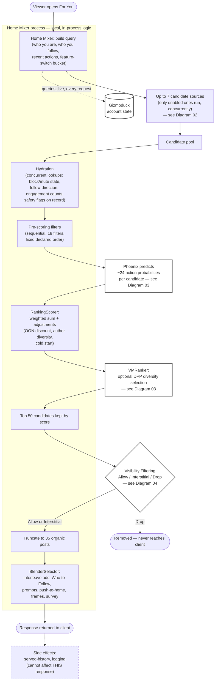

# Diagram 01 — Full For You Pipeline

## One-sentence takeaway

Your feed is assembled by one orchestrator (Home Mixer) running a mix of its own local
code and calls to several separate services, in a specific order — not by one algorithm
making one decision.

## Audience

Anyone who wants the whole map before drilling into any one part. This is the entry
point for every other diagram in this suite.

## Question this answers

"What actually happens, in order, between opening the For You tab and seeing a feed?"

## Semantic wireframe

## Walkthrough

Home Mixer starts by building a "query": who you are, who you follow, what you've
recently done, and which feature-switch bucket you fall into — including a live,
synchronous call to Gizmoduck for your account state. It then runs up to seven candidate
sources concurrently (whichever are enabled for this request — a disabled source
contributes nothing, see Diagram 02), pools their results, and hydrates each candidate
with details every later stage needs.

From there, eighteen pre-scoring filters run in a strict, fixed sequence, removing
duplicates, self-tweets, blocked authors, and similar candidates that should never reach
a scorer. Surviving candidates go to Phoenix, which predicts roughly two dozen possible
reactions per post (see Diagram 03), then to RankingScorer, which turns those predictions
into one score per candidate — entirely as local code inside Home Mixer, not a remote
call. VMRanker, a separate service, can then apply diversity-aware selection (DPP) on top
of that scored list.

The top 50 candidates by score go to visibility filtering, which decides — per viewer,
per post — whether each one is even allowed to be shown at all (see Diagram 04). Survivors
are truncated to 35 organic posts, and BlenderSelector, back inside Home Mixer, weaves in
ads, Who to Follow suggestions, prompts, and other non-post content to build the response
you actually receive. Logging and cache-writing happen after the response is sent and
cannot change what you just got — only a future request.

## Required labels/callouts

- "local, in-process logic" vs. "remote service call" — must be visually distinct
  (Home Mixer subgraph vs. outlined/remote nodes) everywhere in a polished version.
- "concurrent" on the retrieval-source and hydration stages; "sequential, fixed order" on
  the pre-scoring filters and the three scorers.
- "Gizmoduck — queried live, every request" (not grouped with background safety systems).
- "cannot affect THIS response" on the side-effects node.
- Top-50 and 35-post numbers labeled as checked-in defaults.

## What this diagram intentionally omits

- The internal mechanics of each retrieval source (Diagram 02).
- Phoenix's prediction heads and RankingScorer's weight table (Diagram 03).
- Visibility filtering's rule structure and Allow/Interstitial/Drop semantics in detail
  (Diagram 04).
- The safety/reputation label-producer ecosystem behind the safety flags used in
  hydration and visibility filtering (Diagram 05).
- Phoenix retrieval's model architecture (Diagram 06).
- The specific ad-blending strategies inside BlenderSelector (covered only in prose, not
  diagrammed here — see master §12).

## What this diagram must NOT imply

- That all seven retrieval sources always run — only enabled ones do.
- That RankingScorer, the pre-scoring filters, or BlenderSelector are remote calls — they
  are Home Mixer's own local code, a distinction an earlier internal draft of the master
  synthesis's glossary got backwards before correction.
- That reaching "Top 50" or passing visibility filtering guarantees final display —
  truncation and blending still apply afterward.
- That side effects have any influence, however small, on the response already in
  flight.
- That this is the complete system — ads/WTF/prompts blending, safety-label production,
  and model internals are each their own diagram for a reason: cramming them in here
  would overload one image past its one-takeaway budget.

## Provenance

Master synthesis §1 (orchestrator/local/remote distinction), §2 (the full pipeline
diagram and concurrency/sequencing rules), §12 (BlenderSelector as an outer pipeline),
§13 (caching's effect on this path), §14 (failure behavior referenced but not detailed
here).

## Future visual treatment

A wide horizontal or top-to-bottom "assembly line" composition works well here — this is
the diagram most likely to be redrawn as a large poster-style piece. Home Mixer's local
stages could be visually grouped inside a distinct "container" shape (a rounded outline
around the whole process) with remote-service boxes breaking out of that container to
signal the RPC boundary. Reserve the strongest visual weight for the Top-50 →
Visibility-Filtering → Drop path, since that's the single most counter-intuitive moment
in the whole pipeline (see Diagram 04).
