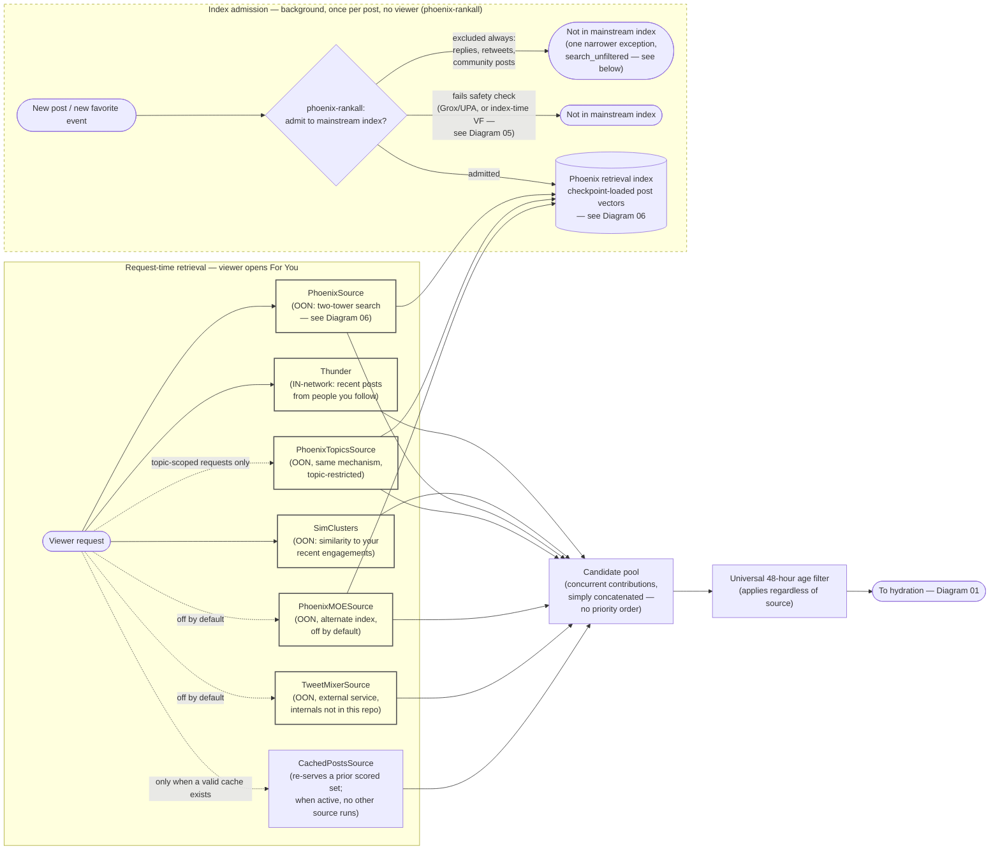

# Diagram 02 — Where Posts Come From

## One-sentence takeaway

Nothing gets ranked or shown unless one of seven retrieval mechanisms finds it first —
and "Phoenix admits a post to its index" and "a specific request searches that index" are
two different systems, not one step.

## Audience

Readers who want to understand what determines the *ceiling* of what can possibly appear
in a feed — the retrieval layer, before any scoring happens.

## Question this answers

"How does a post become eligible to be considered for my feed at all?"

## Semantic wireframe

## Walkthrough

Two separate things have to happen before a post can reach your feed via Phoenix's
retrieval sources. First, long before your request exists, `phoenix-rankall` decides
whether a post is allowed into the retrieval index at all — this runs once per post (on
creation, and again each time its favorite count crosses a power-of-two threshold), for
every future viewer at once. Replies, retweets, and community posts are excluded from the
mainstream indices outright, with one narrower exception (`search_unfiltered`, triggered
only by favorite events) whose reach into any live retrieval path is unknown. Posts also
get excluded here if they fail either of two independent safety checks (Diagram 05).

Second, at actual request time, seven source mechanisms can contribute candidates — but
only the ones enabled for that request run, and they run concurrently with each other.
Thunder is the simple one: recent posts from people you follow, no model involved.
SimClusters is a completely separate, independently-built similarity search seeded by
your recent engagement — with zero recent signals, you get zero SimClusters candidates.
`PhoenixSource`, `PhoenixTopicsSource`, and `PhoenixMOESource` all use the identical
two-tower search mechanism against whatever `phoenix-rankall` admitted, differing only in
which index cluster they query and under what conditions they run. TweetMixer is an
external service with its internals outside this repository, off by default. Cached
posts re-serve a prior result instead of retrieving fresh, and when active, replace all
six other sources for that request.

Whatever survives, from whichever sources ran, is pooled together — with no notion of
"which source found it matters more" — and then a single 48-hour age filter applies
across the board, regardless of source or that source's own retention window.

## Required labels/callouts

- "background, no viewer" on the admission subgraph vs. "per request" on the retrieval
  subgraph — these run at fundamentally different times.
- IN vs. OON label on each source.
- "off by default" / "topic-scoped only" / "only when cache exists" badges on the four
  conditionally-active sources.
- The `search_unfiltered` caveat attached directly to the "excluded always" branch, not
  as a footnote elsewhere.
- 48-hour age filter labeled as a checked-in default.

## What this diagram intentionally omits

- The two-tower model's internal architecture (Diagram 06).
- The full detail of what makes a candidate fail a safety check at admission time
  (Diagram 05).
- Hydration and pre-scoring filtering, which happen after this stage (Diagram 01).
- The exact per-source age/retention windows beyond the universal 48-hour cutoff (Thunder
  ~48h, SimClusters ~2 days internally) — mentioned in prose, not drawn as separate paths.

## What this diagram must NOT imply

- That all seven sources always run — most are gated, and cache mode disables all six
  live sources at once.
- That `phoenix-rankall`'s admission decision and a specific request's two-tower search
  are the same event — one happens once per post, for everyone; the other happens per
  request, against whatever the admission step already allowed in.
- That "excluded from the mainstream indices" means "excluded from Phoenix retrieval,
  full stop" — the `search_unfiltered` branch's live reach is unknown, so this should read
  as "excluded from the branches this document can confirm," not an absolute.
- That SimClusters and Phoenix retrieval are related systems — they are built,
  seeded, and searched completely independently.
- That which source found a candidate has any bearing on its eventual rank — concurrent
  contribution means simple pooling, not a priority queue.

## Provenance

Master synthesis §3 (full retrieval section — both the admission and request-time
layers), §17 (index-time exclusion vs. per-request filtering as a distinction to keep
sharp).

## Future visual treatment

The two-subgraph structure (background admission vs. request-time retrieval) should
probably become two visually distinct "time zones" — perhaps a horizontal split with a
clear time-axis cue, since the biggest misreading risk here is temporal (readers
assuming both halves happen at once). The seven source boxes could use a consistent
icon-plus-one-line-description card format so IN/OON status and default-enabled status
are scannable at a glance without reading full prose.
