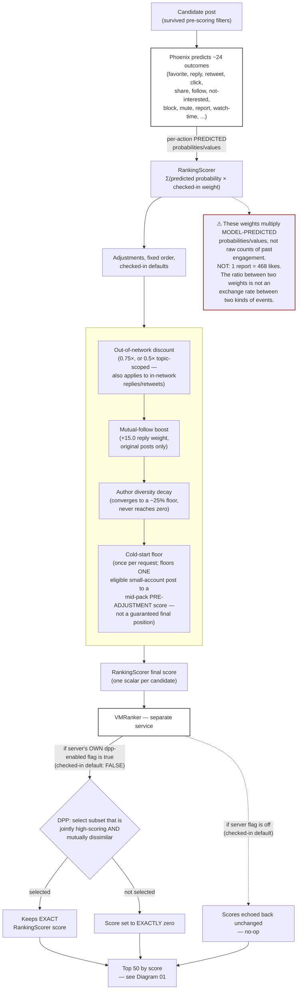

# Diagram 03 — How Ranking Works

## One-sentence takeaway

Ranking is a chain of three different kinds of numbers — Phoenix's predicted
probabilities, RankingScorer's weighted-sum score, and VMRanker's diversity-filtered
result — and none of them is a raw count of what anyone actually did.

## Audience

Readers who want to understand how a score is actually computed, including why the
weight table cannot be read as an exchange rate between engagement events.

## Question this answers

"How does a candidate post's score actually get calculated?"

## Semantic wireframe

## Walkthrough

A candidate that survives pre-scoring goes to Phoenix, which returns roughly two dozen
separate predicted probabilities and values — not one score. RankingScorer multiplies
each of those predictions by a checked-in weight and sums them, entirely as local code
inside Home Mixer. Four adjustments then run, in a fixed order: an out-of-network
discount (which, under today's checked-in defaults, also applies to in-network replies
and retweets — a real, easy-to-miss wrinkle); a mutual-follow boost that currently only
affects the reply weight; a decaying author-diversity discount that suppresses repetition
without ever eliminating it; and a once-per-request cold-start floor that raises one
eligible small account's post to a mid-pack score — before any of the other adjustments
run, so it isn't a guaranteed final position.

The resulting scalar goes to VMRanker, a separate, fully public service. Whether it
actually performs diversity selection (DPP) depends on the *server's own* checked-in flag
— which defaults to off, separately from Home Mixer's checked-in default of always
*requesting* DPP. When DPP does run, it doesn't recompute a score: selected candidates
keep their RankingScorer score exactly, and unselected ones return at exactly zero. When
the server flag is off, VMRanker simply echoes the incoming scores back unchanged.

The warning attached to RankingScorer is the single most important thing on this
diagram: none of these weights are counts of what actually happened. They multiply a
*predicted probability*, and a large negative weight exists specifically because the
predicted probability it's attached to is small — not because the underlying event is
common.

## Required labels/callouts

- "PREDICTED" in caps or bold wherever Phoenix's output is labeled, to visually
  distinguish it from an observed count.
- Checked-in-default badges on every specific number: 0.75×/0.5× OON discount, +15.0
  boost, the diversity-decay floor, the cold-start rank position, and the
  `--dpp-enabled=false` server default.
- "EXACT" / "EXACTLY zero" on the DPP keep/reject outcomes — this is a hard rule, not an
  approximation.
- The warning box, non-optional in any redesign of this diagram.
- Explicit "checked-in default: FALSE" label on VMRanker's own DPP flag, distinct from
  Home Mixer's request-side default.

## What this diagram intentionally omits

- The full checked-in weight table (all fourteen values) — belongs in prose/a table next
  to this diagram, not crammed into the flowchart itself.
- What happens to a candidate that exceeds Phoenix's per-request scoring capacity
  (mentioned in master §5; not drawn here since it's a retrieval/serving-capacity concern,
  not a ranking-formula one).
- Visibility filtering, which runs after this entire stack (Diagram 04).
- The specific embedding mechanics DPP's similarity kernel uses.

## What this diagram must NOT imply

- That weight ratios are exchange rates between raw engagement events — this is the
  single most important misreading this diagram exists to prevent.
- That DPP "usually" runs — the server-side default is off; whether it's on in
  production is unknown.
- That the cold-start floor guarantees a final feed position — it sets a pre-adjustment
  floor only; later adjustments (author diversity, OON discount if applicable, DPP) can
  still move that candidate anywhere.
- That RankingScorer's output is "the algorithm's opinion" of the post in some absolute
  sense — it's one scalar, produced from checked-in weights, that other stages (VF,
  truncation, blending) can still override or exclude entirely.
- That Phoenix's ~24 predictions are all equally weighted or equally consequential — several
  are weighted at exactly zero under checked-in defaults.

## Provenance

Master synthesis §5 (Phoenix's prediction structure), §6 (RankingScorer's formula and
full weight table, including the explicit warning against reading it as an exchange
rate), §7 (the four adjustments, in the order shown), §8 (VMRanker/DPP, both defaults).

## Future visual treatment

This is a strong candidate for a horizontal "assembly line" layout with the warning box
rendered as a persistent banner rather than a floating annotation — something that stays
visible even if a viewer only skims the diagram. Consider a small inset showing the
worked arithmetic example from master §6 (favorite/reply/retweet summing to ~0.11,
report alone at ~-0.117) as a companion callout box, explicitly labeled "illustrative
example, not observed data."
