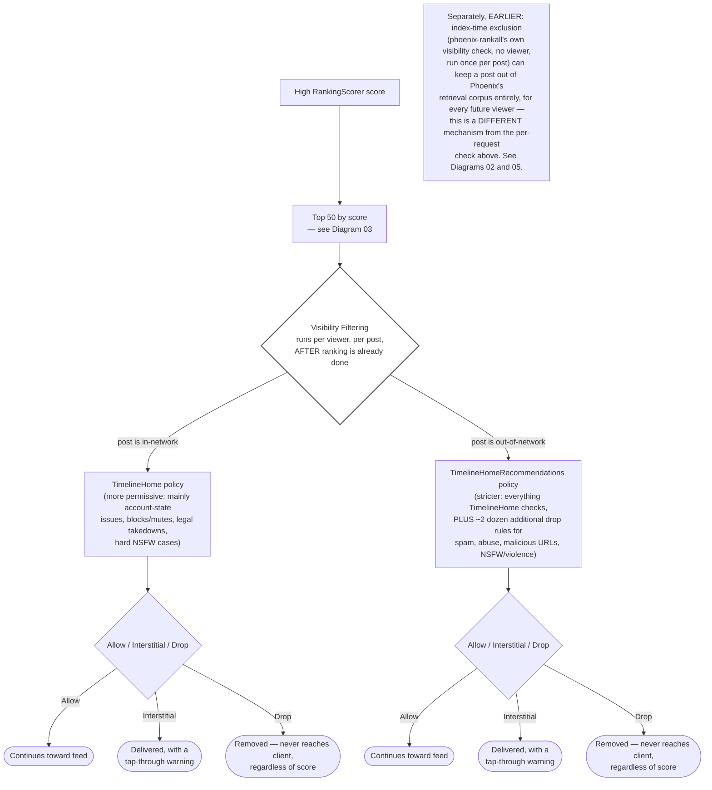

# Diagram 04 — Ranking vs. Visibility Filtering

## One-sentence takeaway

A post can score higher than almost everything else in the batch and still never reach
you — ranking and visibility filtering are two separate questions, answered by two
separate systems.

## Audience

Everyone. This is the single most memorable, most myth-correcting diagram in the suite —
it should work for a reader who looks at nothing else in this project.

## Question this answers

"Does a high score guarantee a post gets shown?"

## Semantic wireframe

**Headline framing for the polished version:** *Ranking asks: how valuable might this be
to this viewer? Visibility asks: what treatment is allowed in this context?*

## Walkthrough

Everything up to this point in the pipeline (Diagram 03) has been about scoring a post as
highly as possible. Visibility filtering is a structurally separate question: given this
specific viewer and this specific post, is it even allowed to be shown, in this context,
at all? It runs *after* the top-50 selection — meaning it evaluates posts the scoring
stages already approved, and it can still remove them.

Which policy a post is checked against depends on whether it's in-network or
out-of-network relative to the viewer. In-network content gets the more permissive
`TimelineHome` policy. Out-of-network content — and any ancestor, quote, or retweet
target pulled in from outside the follow graph — gets the meaningfully stricter
`TimelineHomeRecommendations` policy, with roughly two dozen additional drop rules that
simply don't apply to people you already follow.

Either way, the outcome is one of three things: Allow (nothing changes, evaluation
continues), Interstitial (the post is still delivered, flagged for a tap-through
warning), or Drop (the post is removed before the response is ever built). The exact
same post, carrying the exact same label, can land in different outcomes depending on
whether the viewer follows the author — this isn't a bug, it's how the rule set is
designed: to restrict algorithmic discovery of borderline content, not erase it for
people who already opted in by following the account.

The note at the bottom flags something easy to conflate with this diagram but genuinely
different: a separate, earlier, viewer-less check can keep a post out of Phoenix's
retrieval corpus entirely, before any request — and before any individual viewer's
visibility filtering ever runs. That's a different mechanism, covered in Diagrams 02 and
05, not the same system shown here.

## Required labels/callouts

- "AFTER ranking is already done" on the Visibility Filtering node — the ordering is the
  point.
- "regardless of score" on both Drop outcome nodes.
- IN-network vs. OON-network labels on the two policy branches, with the rule-count
  difference stated explicitly ("~2 dozen additional drop rules").
- Interstitial explicitly labeled "still delivered" to prevent conflation with Drop.
- The index-time-exclusion note, clearly marked as a *different, earlier* mechanism, not
  folded into the per-request flow above it.

## What this diagram intentionally omits

- The full rule-evaluation order within visibility filtering (first-Interstitial-sticks,
  first-Drop-ends-evaluation) — stated in prose in the master synthesis, not diagrammed
  here to keep this diagram to one takeaway.
- The exact label → consequence table (master §11) — belongs as a companion reference
  table, not inside this flowchart.
- Visibility filtering's own failure-mode behavior (fails open on a whole failed batch,
  fails closed on a missing post ID) — that's a Diagram-01/failure-table concern, not this
  diagram's job.
- The specific safety-label producer chain feeding these rules (Diagram 05).

## What this diagram must NOT imply

- That a high RankingScorer score is meaningless — it's necessary to reach the top 50 in
  the first place; visibility filtering is an additional, independent gate, not a
  replacement for scoring.
- That "Allow" guarantees the post reaches the viewer — truncation to 35 posts and
  BlenderSelector's insertion logic still apply afterward (Diagram 01).
- That Interstitial and Drop are two flavors of the same outcome — only Drop removes the
  post from the response.
- That index-time exclusion and per-request visibility filtering are the same check run
  twice — they're different systems, with different scopes (viewer-less/universal vs.
  per-viewer) and different failure behavior.
- That every out-of-network post gets dropped, or every in-network post gets shown — both
  policies produce all three outcomes; OON is stricter, not maximally restrictive.

## Provenance

Master synthesis §9 (the full VF section: separate-question framing, policy split,
Allow/Interstitial/Drop semantics), §11 (concrete label examples showing the same-label,
different-outcome pattern), §16 walkthrough C (the worked example this diagram's headline
scenario is drawn directly from), §10 (index-time exclusion, for the note).

## Future visual treatment

This diagram earns the most polish of the six — it's the one most likely to get shared on
its own. A vertical "funnel narrowing, then forking" composition works well: score and
Top-50 as a single narrowing funnel, then a visible fork into two policy lanes, each
ending in three clearly color-differentiated terminal states. The index-time-exclusion
note could become a small "earlier, elsewhere" side-panel rather than living in the main
flow, so it doesn't compete visually with the primary fork.
