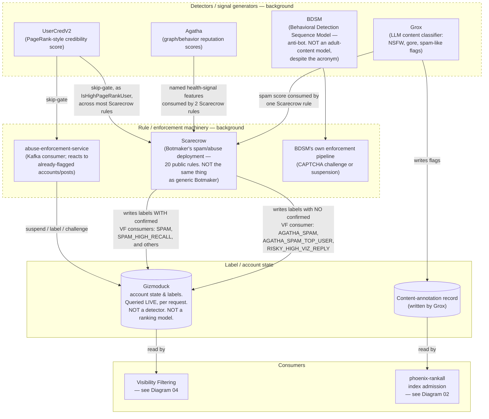

# Diagram 05 — Safety / Reputation Signal Flow

## One-sentence takeaway

A handful of background detectors feed a handful of enforcement systems that write labels
into account/post state — and only some of those labels demonstrably reach your feed;
several confirmed, actively-written labels have no confirmed consumer at all.

## Audience

Readers trying to make sense of the codename-heavy safety ecosystem (Agatha, BDSM, Grox,
Botmaker/Scarecrow, Gizmoduck) without conflating names that sound similar or assuming
every detector feeds every rule system.

## Question this answers

"Where do the safety labels visibility filtering checks actually come from?"

## Semantic wireframe

## Walkthrough

Four background systems generate signals: Grox is an LLM-based content classifier
writing boolean flags (NSFW, gore, spam-like) once a post crosses an engagement
threshold; Agatha computes graph- and behavior-derived reputation scores; BDSM classifies
a user's recent action sequence for bot-like behavior across eight categories — despite
the acronym, it has nothing to do with adult content; UserCredV2 computes a PageRank-style
credibility score from the real follow graph.

These feed two enforcement systems. Scarecrow — the specific, production-flavored
deployment of the general-purpose Botmaker rule engine, not Botmaker itself — consumes
Grox's spam score, Agatha's named health-signal features, and UserCredV2 (as a skip-gate
used across nearly all its rules), and writes labels. Separately,
abuse-enforcement-service reacts to already-flagged accounts or posts as a Kafka consumer,
using UserCredV2 as its own skip-gate, and can suspend, label, or challenge.

Both write into Gizmoduck, the account-state store — which is not a detector itself, just
where labels and account state accumulate, and which is queried live and synchronously
on every single request, unlike the genuinely background systems above it. Some labels
Scarecrow writes have a confirmed downstream consumer in visibility filtering (`SPAM`,
`SPAM_HIGH_RECALL`, and others in master §11's table); others — `AGATHA_SPAM`,
`AGATHA_SPAM_TOP_USER`, `RISKY_HIGH_VIZ_REPLY` — are real, actively-written labels with no
confirmed consumer anywhere in visibility filtering's rule set under those exact names.
Separately, Grox's content-annotation record feeds `phoenix-rankall`'s retrieval-index
admission decision directly (Diagram 02) — a different consumer than visibility
filtering.

## Required labels/callouts

- "BDSM ≠ adult content" and "Botmaker ≠ Scarecrow" as persistent, non-optional
  corrections — these are the two most likely name-based misreadings in the whole
  project.
- "Gizmoduck: queried LIVE, per request. NOT a detector." — distinguishing it visually
  from the dashed/background detector and enforcement boxes.
- Explicit "no confirmed VF consumer" label on the arrow carrying `AGATHA_SPAM`,
  `AGATHA_SPAM_TOP_USER`, and `RISKY_HIGH_VIZ_REPLY` — don't let this arrow look the same
  as a confirmed-consequence one.
- "20 public rules" on Scarecrow, with a note that this is a subset of unknown
  completeness relative to production, not the whole corpus.

## What this diagram intentionally omits

- The exact 20 Scarecrow rules by name and threshold (a reference table, not a diagram).
- The full label → in-network/OON consequence table (master §11; belongs next to Diagram
  04, not duplicated here).
- BDSM's actual redacted thresholds (they're not published — nothing to draw).
- The index-time visibility-filtering check `phoenix-rankall` runs separately from Grox's
  content-annotation path (mentioned in the RANKALL node's context but detailed in
  Diagram 02, not here, to avoid duplicating that diagram's content).

## What this diagram must NOT imply

- That every detector feeds every enforcement system — arrows here represent only
  relationships the master synthesis actually establishes; a missing arrow between two
  boxes is a "not shown as connected in this snapshot," not "definitely unconnected."
- That Agatha's scores generally have no consumers — its *formal output types* don't, but
  specific named features from it demonstrably do, via Scarecrow.
- That a label existing and being actively written proves it affects your feed — several
  labels shown here explicitly do not have a confirmed consumer.
- That Gizmoduck detects anything — it's where state accumulates and gets read from, not
  where detection logic runs.
- That this is the complete safety/reputation system — this repository shows a partial,
  real, traceable subset, not the entirety of what X operates.

## Provenance

Master synthesis §10 (the full safety-label ecosystem: Grox, Agatha, BDSM, UserCredV2,
Botmaker/Scarecrow, abuse-enforcement-service, Gizmoduck, and the producer→consumer
chain diagram this wireframe expands on), §11 (the concrete label examples and the
explicit "no confirmed consumer" callouts for `AGATHA_SPAM`/`AGATHA_SPAM_TOP_USER`/
`RISKY_HIGH_VIZ_REPLY`/`COPYPASTA_SPAM`).

## Future visual treatment

This diagram will likely need the most name-recognition support of the six — consider a
small "codename decoder" legend as a permanent fixture alongside it (one line per
proper noun, in plain language) rather than relying on in-diagram labels alone to carry
that weight. A layered, top-to-bottom composition (detectors → enforcement → state →
consumers) with visually distinct "confirmed consequence" vs. "no confirmed consequence"
arrow styles would make the AGATHA_SPAM-style gap immediately legible without extra
reading.
