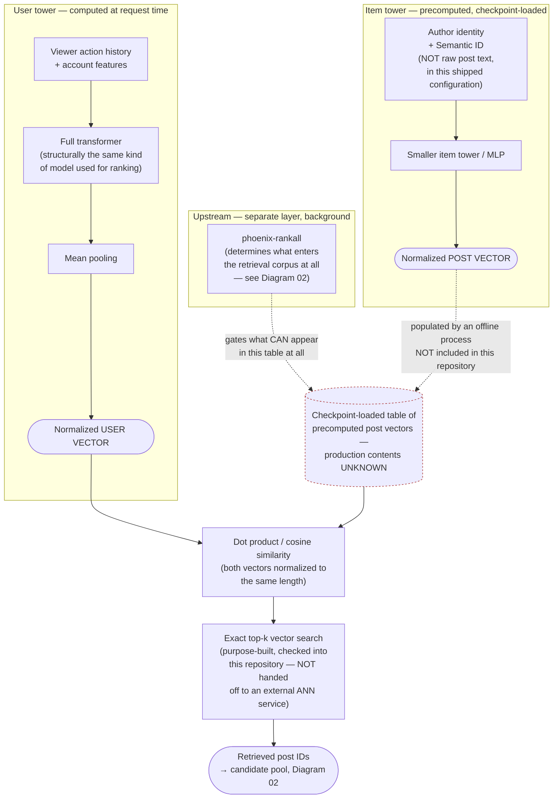

# Diagram 06 — Phoenix Two-Tower Retrieval

## One-sentence takeaway

Phoenix's shipped reference retrieval model turns you and a candidate post into two
separately-computed vectors and compares them with a plain dot product — a real,
checked-in search implementation, but one whose production checkpoint and real post-vector
table aren't in this repository.

## Audience

Readers who want to understand the model mechanics behind `PhoenixSource` and its
siblings, one level deeper than Diagram 02's retrieval overview.

## Question this answers

"How does Phoenix's retrieval search actually decide which posts are close to a given
viewer?"

## Semantic wireframe

## Walkthrough

The user tower is a full transformer — structurally the same kind of model used on the
ranking side — that reads a viewer's action history and account features and produces a
single vector. The item tower is much simpler: a smaller network that produces a vector
for each candidate post from its author identity and a compact "semantic ID," rather than
raw post text, in this shipped reference configuration. Both vectors are normalized to
the same length, so a plain dot product between them behaves like cosine similarity — the
closer their directions point, the more similar the model considers that viewer and that
post.

At serving time, this repository's own code performs the actual search: the viewer's
vector is compared against a large, checkpoint-loaded table of precomputed post vectors,
and the closest matches are selected using a purpose-built top-k search implementation
checked into this repository — not handed off to an external nearest-neighbor service.
The training objective is worth naming precisely: the model is trained so a viewer's
vector moves closer to a post's vector specifically when that viewer favorited it, with a
second, broader head trained on a wider set of engagement types for a different product
surface.

Two things upstream of this diagram matter and are drawn as explicitly separate:
`phoenix-rankall` (Diagram 02) gates what's even allowed to exist in the post-vector table
in the first place, and a separate offline process — not included in this repository —
would have populated that table's actual contents for X's real corpus. Neither the
trained checkpoint nor that offline population process is available in this snapshot,
which is why the table itself carries an explicit "unknown" marker rather than being drawn
as a simple, fully-known data store.

## Required labels/callouts

- "NOT raw post text" on the item tower's input, with "in this shipped configuration" —
  don't state this as an unconditional architectural fact if the shipped config itself is
  a configurable flag.
- "production contents UNKNOWN" badge on the post-vector table — this is the single most
  important unknown in this diagram.
- "NOT handed off to an external ANN service" on the top-k search box — the search is
  exact top-k, checked into this repository, and should never be called "ANN" or
  "approximate" without that qualifier, since the implementation documented here performs
  exact top-k selection.
- Explicit separation between `phoenix-rankall` (admission) and the offline embedding-
  population job (neither of which is the same as the search shown in the main flow).

## What this diagram intentionally omits

- The training loss function and hard/soft-negative action lists (training-time detail,
  not serving-time mechanics — out of scope for a request-time retrieval diagram).
- The int8-quantized variant of the top-k search (a compute-optimization detail, not a
  different algorithm — not worth a separate path in a wireframe).
- `PhoenixTopicsSource`/`PhoenixMOESource`'s cluster-selection differences from
  `PhoenixSource` (covered in Diagram 02; this diagram shows the shared underlying search
  mechanism all three use).
- Which specific cluster of this retrieval service each `Phoenix*Source` reaches at
  runtime (unknown from this snapshot; not something a diagram can show).

## What this diagram must NOT imply

- That this is confirmed to be what production actually runs — it's the repository's own
  shipped reference implementation, not an independently verified production fact.
- That the post-vector table is fully populated and current in any deployed sense — its
  real-world contents, and the process that would build them, are both absent from this
  repository.
- That this search is approximate nearest-neighbor search in the colloquial sense — the
  documented implementation is exact top-k over the table it's given, not an ANN index
  structure.
- That SimClusters uses any part of this mechanism — it's a completely separate,
  independently-built similarity system (Diagram 02).
- That semantic ID resolution to richer content is proven by this diagram — its presence
  in the model's input is DIRECT evidence; what it resolves to is STRONG INFERENCE, not
  something this repository's code proves.

## Provenance

Master synthesis §3 (the two-tower retrieval paragraph, including training objective and
serving-side search); final residual report `PHOENIX_SERVING_AND_RETRIEVAL.md`,
"Synthesis impact" item 2 (the specific addition this diagram is built from) and its
"Directly established" / "Not knowable" tables (checkpoint absence, offline-embedding-job
absence, live cluster-binding unknown).

## Future visual treatment

A clean left/right symmetric composition (user tower left, item tower right, converging
to a single comparison point in the center) reads naturally and mirrors how the source
material itself describes the architecture. The post-vector table's "unknown contents"
status could be rendered as a visibly different texture or fill (e.g., a hatched pattern)
rather than just a badge, since it's the load-bearing caveat for the entire diagram — a
reader should be unable to miss it even at a glance.
